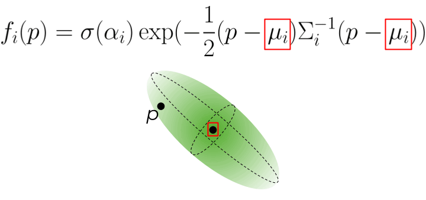
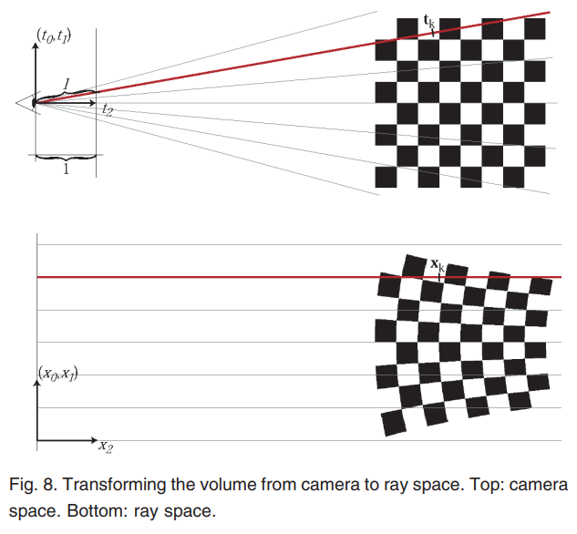

[3D Gaussian Splatting for Real-Time Radiance Field Rendering](https://repo-sam.inria.fr/fungraph/3d-gaussian-splatting/)

**[목차]**

### **Ⅰ. 연구의 배경**

- **NeRF**
    - 문제점
        - Ray marching은 ray 상의 수많은 점을 샘플링해야 하기 때문에 계산 비용이 크다.
        - 파라미터 수가 많은 MLP는 속도에 악영향을 준다.
        - 본질적으로 훈련과 렌더링 속도가 느릴 수밖에 없다.
    - 속도 증가를 위한 최근 동향
        - feature을 공간적 자료 구조에 저장하여 보간한다.
        - 인코딩 방식을 다르게 한다.
    - 예시
        - InstantNGP: hash grid & occupancy grid
        - Plenoxels: sparse voxel grid
        - 둘다 Spherical Harmonics를 사용한다.
        - empty space를 효율적으로 처리하지 못하는 등의 단점이 존재한다.
- **Point-Based Rendering**
    - **Point-based alpha blending and NeRF-style volumetric rendering**
        
        $$
        C=\sum_{i=1}^NT_i\alpha_ic_i
        $$
        
        where
        
        $$
        \alpha_i=(1-exp(-\sigma_i\delta_i)) ,\ T_i=\prod_{j=1}^{i-1} (1- \alpha_j)
         
        $$
        
    - **Typical neural point-based approach ([https://arxiv.org/pdf/2301.01087](https://arxiv.org/pdf/2301.01087))**
        
        $$
        C = \sum_{i\in\mathcal{N}}c_i\alpha_i\prod_{j=1}^{i-1} (1- \alpha_j)
        $$
        
    - 모델은 동일하나, 렌더링 알고리즘이 다르다.
        - NeRF는 empty/occupied space에서 point를 랜덤 샘플링하는 implicit representation
        - Point는 position, normal + opacity, *footprint*을 direct representation으로, scene의 조작이 쉽다.
- **Rasterization**
    - Fast sphere rasterization ([https://arxiv.org/pdf/2004.07484](https://arxiv.org/pdf/2004.07484))
        - CNN을 사용하여 일시적 불안정성을 보인다.
        - 가시성의 순서에 독립적이다.
    - Diffuse point-based rendering track of Neural Point Catacaustics ([https://arxiv.org/pdf/2301.01087](https://arxiv.org/pdf/2301.01087))
        - MLP를 사용하여 일시적 불안정성을 극복했다.
        - MVS를 input으로 요구한다.
    - **3DGS**
        - 정렬된 splat에 기존의 알파 블랜딩 기법을 사용한다.
        - 모든 픽셀의 splat에 그래디언트를 backpropagate 하고 비등방석 splat을 래스터라이즈한다.
        - MVS를 요구하지 않는다. (대신 SfM을 요구한다.)
            - SfM은 이미지를 통해 카메라 포즈와 sparse한 포인트 클라우드를 출력하며, MVS는 이미지와 카메라 포즈(SfM의 결과물)를 이용하여 dense한 모델을 출력한다.

### **Ⅱ. 3차원 가우시안 (3D Gaussian)**

- **도입 배경**
    - 미분 가능하며 (Differentiable), 쉽게 2D 가우시안으로 투영(project)될 수 있다.
    - 이를 통해 빠른 알파 블랜딩을 수행하여 렌더링 가능하다.
    - SfM의 sparse한 포인트 클라우드서 normal을 최적화하는 것은 매우 어려우므로, 대신 3차원 가우시안을 사용한다.
- **개념**
    
    $$
    𝐺 (𝑥) = 𝑒^{-\frac{1}{2}(𝑥)^T Σ^{-1}} (𝑥 )
    $$
    
    - where Σ is 3D covariance matrix (3x3), center point(mean). Multiplied by 𝛼 in blending process.
        
        
        
- **공분산 행렬 (covariance matrix)의 표현**
    
    $$
    Σ = 𝑅𝑆𝑆^𝑇𝑅^𝑇
    $$
    
    - 3차원적으로 의미를 가지려면, 양의 준정부호 (positive semi-definite)여야 한다. (xTΣx ≥ 0)
    - 직접적으로 행렬을 최적화할 경우 이를 만족하지 못할 확률이 높다.
    - 즉, scaling matrix S와 rotation matrix R로 공분산 행렬을 정의한다.
    - 실제로는 scaling을 위해 3D 벡터 s와 rotation을 위해 단위 쿼터니언 q를 정의하고, 이를 행렬로 전환한다.
- **투영 (2D Projection)**
    
    $$
    Σ^′ = 𝐽𝑊 Σ 𝑊^𝑇𝐽^𝑇
    $$
    
    - where Σ’ is 2D covariance matrix in camera space(view space아닌가?), view transform 𝑊, Jacobian of the affine approximation of the projection transform 𝐽 (2x3 matrix).
        - **https://github.com/joeyan/gaussian_splatting/blob/main/MATH.md**
    
    $$
    J = \begin{bmatrix} f_x / z & 0 & -f_x x/z^2 \\\ 0 & f_y/z & -f_yy/z^2\end{bmatrix}
    $$
    
    - 유도과정 ([https://xoft.tistory.com/49](https://xoft.tistory.com/49), [https://www.cs.umd.edu/~zwicker/publications/EWASplatting-TVCG02.pdf](https://www.cs.umd.edu/~zwicker/publications/EWASplatting-TVCG02.pdf) 참고)
        
        
        
        - camera space의 좌표 t를 ray space의 좌표 x로 변환하는 것은 비선형이다.
        - 비선형 변환을 선형 변환으로 만들기 위해 2차 테일러 다항식으로 근사한다.
            
            $$
            \phi_k(\mathbf{t}) = \phi(\mathbf{t_k}) + \mathbf{J_k} \cdot (\mathbf{t} - \mathbf{t_k}) 
            $$
            
        - 여기서는 z=1로, 즉 fx, fy가 1로 설정되었다.
        
        $$
        ϕ(t)=(\frac{t_0}{t_2},\frac{t_1}{t_2}, ∥(t_0,t_1,t_2)^⊤∥)
        $$
        
        $$
        l'=∥(t_0,t_1,t_2)^⊤∥=\sqrt({t_0}^2+{t_1}^2+{t_2}^2)
        $$
        
        $$
        \begin{align} 
        \frac{\partial l'}{\partial t_0} 
        & = \frac{\partial}{\partial t_0} \left( \sqrt{t_0^2 + t_1^2 + t_2^2} \right) \\
        & = \frac{1}{2} \cdot (t_0^2 + t_1^2 + t_2^2)^{-\frac{1}{2}} \cdot 2t_0 \\
        & =\frac{t_0}{\sqrt{t_0^2 + t_1^2 + t_2^2}} \\
        & =\frac{t_0}{l'}
        \end{align}
        $$
        
        $$
        J_k = \frac{\partial \phi}{\partial t_k} = 
        \begin{pmatrix}
        \frac{1}{t_{k,2}} & 0 & -\frac{t_{k,0}}{t_{k,2}^2} \\
        0 & \frac{1}{t_{k,2}} & -\frac{t_{k,1}}{t_{k,2}^2} \\
        \frac{t_{k,0}}{l'} & \frac{t_{k,1}}{l'} & \frac{t_{k,2}}{l'}
        \end{pmatrix}
        
        \text{where } l' = ∥(t_0,t_1,t_2)^⊤∥
        $$
        

### **Ⅲ. 최적화 (Optimization)**

- **Gaussian parameters**
    - 위치 𝑝
    - 𝛼
    - 공분산 Σ (S / R)
    - SH 계수 (각 가우시안의 c값을 표현함) (방향에 따라 색이 달라지므로)
- **기능**
    - 잘못된 투영이 있을 수 있으므로, 최적화 과정에서 가우시안을 **생성/삭제/이동**해야 한다.
- **방식**
    - Stochastic Gradient Descent (SGD)
    - Activation function
        - 𝛼: **sigmoid** (부드러운 기울기와 [0,1) 제한)
        - S: **exponential** (비슷한 이유(?))
    - 처음에는 공분산 Σ을 등방성 가우시안으로 초기화한다. (가장 가까운 세 점까지의 거리 평균)
    - 위치(𝑝 or M)에 exponential decay scheduling을 통해 lr을 조절한다. (Plenoxels)
    
    $$
    \mathcal{L} = (1 − 𝜆)\mathcal{L}_1 + 𝜆\mathcal{L}_{D-SSIM}
    $$
    
- **알고리즘**
    
    
    
    - **Densify**
        - 매 100 iteration마다 수행한다.
        - view space에서의 gradient가 큰 경우이다. (threshold=0.0002)
        - Under-reconstruction (small gaussian)
            - Clone (= create)
        - Over-construction (large gaussian)
            - Split (divide factor 𝜙 = 1.6)
        - 직관적으로 보았을 때, reconstruction이 잘 진행되지 않은 곳에 대해서 가우시안을 이동하는 것이라고 볼 수 있다.
    - **Prune**
        - 투명한 가우시안을 삭제한다.
        - 𝛼 less than a threshold 𝜖
    - 𝛼 값 초기화 (0으로)
        - 3000 iteration마다 수행한다.
        - 가우시안의 개수가 너무 많아져 floater가 생기는 문제를 해결한다.

### **Ⅳ.** 래스터라이저 (Fast Differentiable Rasterizer)

- Tile-based 래스터라이저
- **알고리즘**
    
    
    
    - 16x16 tiles로 화면을 분할함
    - view frustum 밖의 가우시안을 삭제함 (99%이상이 view frustum과 겹치는 경우만 살림)
    - 부정확한 투영 연산으로 인해, 극한 위치에 있는 가우시안에 대해 보호 대역(guard band)을 사용
    - 가우시안을 겹치는 tile의 개수에 따라 인스턴스화하고, 각 인스턴스에 key를 부여한다.
        - key는 tile ID와 view space depth를 결합한다.
    - 가우시안 인스턴스를 key에 따라 GPU radix sort한다.
        - sort의 결과에 따라 알파 블랜딩이 수행된다.
    - 각 tile마다, **view space depth에 따른 리스트**를 만들고, 스레드 블록(CUDA programming)을 생성한다.
        - 스레드 블록은 가우시안을 공유 메모리에 불러온다.
        - 스레드 블록은 픽셀의 리스트를 처음부터 끝까지 순회하며 color와 alpha를 축적한다.
        - 이를 통해 데이터 로드/공유, 처리에 대해 병렬처리가 가능해진다.
        - 픽셀의 𝛼값이 목표 포화(*saturation*) 수준에 도달하면 (ex. 𝛼=1) 픽셀의 스레드 블록이 멈춘다.
    - Backward pass
        - 각 픽셀은 c에 기여한 마지막 점의 깊이보다 적거나 같은 깊이의 점들만 처리한다.
        - 다시 탐색하는 것을 막기 위해, 끝에서 총 누적 불투명도만 저장함으로써 중간 불투명도를 복구한다.

### **Ⅴ.** 한계 및 생각

- 한계
    - artifacts가 존재한다. (floaters)
    - urban dataset에서는 위치 lr의 감소가 필요하다.
    - GPU memory 소비량이 NeRF에 비해 크다.
- 생각
    - 가우시안 개수 조절 알고리즘을 개선할 수 있을 것 같다.
    - mip360 데이터셋에서 좋지 못한 성능을 보였는데, 이유를 찾아봐야겠다.
    - SfM (COLMAP) 과정이 없이 수행할 수 있는 방법이 필요하다.
