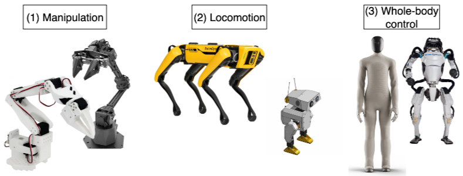

[arxiv.org](https://arxiv.org/pdf/2510.12403)

# Robot Learning: A Tutorial

## 2. Classical Robotics

---

### Robot Types and Methods

- 로봇의 종류들 - Manipulation, Locomotion, whole-body control(Humanoid)
- SO-100은 저렴하지만 Aloha/Franka Emika Panda는 비싸다
    - 시뮬레이터가 괜히 있는게 아니구나

- Explicit/Implicit Models
    - Explicit: Dynamic based methods (동역학 -  FK/IK 기반)
    - Implicit: Learning-based methods (요즘 트렌드)

### Forward/Inverse Kinematics

- Configuration -> Pose : Forward Kinematics (FK)
- Pose -> Configuration : Inverse Kinematics (IK)
    - 원하는  End-effector의 포즈를 위해 joint configuration을 추정하는 것
- Inverse Kinematics
    - Analytical solution:  환경에 장애물이 있을 때 구하기 어려움
    - 따라서 iterative optimization을 통해 구함
        
        $$
        \min_{q \in Q} \|p(q) - p^*\|_2^2.
        
        $$
        
    - 그러나 이것 역시 **시간에 따른 trajectory에 대해 설명할 수는 없음** (그저 pose에 대한 config만)
    - Differential IK
        - joint 의 절대적인 위치 대신,  joint 속도(\dot{q}(t)) 를 제어하여 End-effector의 목표 속도를 추적
        
        $$
        \dot{q}(t) = \operatorname{arg\,min}_{\nu} \left\lVert J(q(t))\nu - \dot{p}^{*}(t) \right\rVert_{2}^{2}
        $$
        
        - pose ‘p’는 configuration ‘q’에 대한 함수, J(q)는 이 함수에 대한 변화율임. q의 변화가 p의 변화로 어떻게 매핑되는지 보여주는 선형 변환.
        - 즉 p의 변화율 = J(q) q의 변화율. 즉 문제의 초점을 configuration에서 velocity로 옮겨서 해결
        - 그러나 이것 역시 **Well-controlled, static env에서만 효과적이며 오류 발생 가능성이 높다**
- Adding Feedback Loops
    - IK의 한계점을 위해 도입
    - 목표 pose 와 현재 pose 사이의 오차를 계산하고 이 오차를 기반으로 로봇의 configuration을 수정
        - 그러나 이것 역시 **gain tuning이 어렵고, hybrid dynamics (mode switches) 및 discontinuities in Jacobian을 해결하기 어려움**

### Limitations of Dynamics-based Robotics

- Classical Methods
    - Lack of Generalization
    - Integration and Scalability Issues
        - Multimodal data 처리가 어려움
    - Difficulty in Accurate Physical Modeling
        - Rigid body assumption 등이 실제 적용에 어려움을 줌
    - Overlooking Data Trends
        - 현재 급증하는 오픈소스 데이터셋의 증가 추세를 활용하지 못함

→  결론: learning-based approach가 좋다. (마치 SLAM 같군….)

- Learning method에는 RL(Reinforcement Learning)과 BC(Behavior cloning = imitation)이 있음
- RL→BC로 트렌드가 바뀜 (최근 VLA논문만 봐도 그런듯)
- ‘Generalist’ Policy는 language conditioned이고 instruction을 통해 motion을 만듦
- 일단 여기 나와있는 예시는 Lerobot에서 지원하는것만 나열한 것임.

## 3. Robot (Reinforcement) Learning

---

1. What is RL(강화학습)?
    
    
    
    - ML의 한 분야로 “에이전트(Agent)”가 “환경(Environment)”와 지속적으로 상호작용하여 최적의 “정책(Policies)”을 학습하는 것을 목표로 함
        - Agent는 Explicit한 problem modeling 대신 상호작용 데이터를 통해 Trial and error로 스스로 개선함
    
    > Reinforcement Learning is a discrete time stochastic control process,
    > 
    > 
    > where an agent interacts with its environment/state. 
    > 
    > 강화학습은 AI Agent가 특정 state/situation 내에 최대의 보상 Q를 가져다주는 action을 학습하는 과정이다.
    > 
    - **Markov Decision Process (MDP)**
        - Discrete time을 가정함
        - M = ⟨S, A, D, r, γ, ρ, T ⟩
            - S=state space, A=action space, D=environment dynamics
            - r: S × A × S → R = reward function
            - γ ∈ [0, 1) discount factor(immediate vs. long-term reward)
            - ρ=distribution over S for initial (s_0 ~ρ)
            - T=length
                
                $$
                \tau = (s_0, a_0, r_0, s_1, a_1, r_1, \dots, s_{T-1}, a_{T-1}, r_{T-1}, s_T)
                $$
                
        - Markov assumption을 통해 joint probability conditional probability의 곱으로 분해할 수 있음
            
            $$
            \mathbb{P}(\tau) = \mathbb{P}(s_0) \prod_{t=0}^{T-1} \mathbb{P}(s_{t+1}|s_t, a_t) \mathbb{P}(a_t|s_t).
            $$
            
        - policy P(at|st)는 πθ (at|st)로 표현되며 return(=cumulative discounted reward) maximize하는 방식으로 학습됨
            
            $$
            G(\tau) = \sum_{t=0}^{T-1} \gamma^t r_t.\\
            J(\pi_\theta) = \mathbb{E}_{\tau \sim \mathbb{P}_{\theta;D}}[G(\tau)],
            
            $$
            
        - 그래서 optimal policy π∗ = arg maxθ J(πθ ) 이다.
        - 또한 이건 state과 action간의 쌍이 얼마나 ‘바람직한지’ 판단하는데 사용될 수 있다.
            - 특정 policy인 π 에서, V=state-value func, Q=state-action value func
            
            $$
            V_{\pi}(s) = \mathbb{E}_{\tau \sim \pi}[G(\tau) | s_0 = s]\\
            Q_\pi (s, a) = \mathbb{E}_{\tau \sim \pi} [G(\tau)|s_0 = s, a_0 = a].\\
            
            $$
            
            $$
            \begin{align*}
            Q_\pi(s_t, a_t) &= \mathbb{E}_{s_{t+1} \sim \mathbb{P}(\bullet|s_t,a_t)}[r_t + \gamma V_\pi(s_{t+1})] \\
            V_\pi(s_t) &= \mathbb{E}_{a_t \sim \pi(\bullet|s_t)}[Q_\pi(s_t, a_t)],
            \end{align*}
            $$
            

1. Real-world RL for Robotics
    - 하지만 실제로 Real world에서 적용하기에는 simulation과 real world의 gap이 커서 어렵다.
    - 단점
        - Safety and Erratic(예측 불가능) Actions
        - Learning Efficiency
            - RL 알고리즘은 일반적으로 많은 수의 상호작용 데이터를 필요로 하며, 실제 하드웨어에서 이 데이터를 생성하는 것은 시간이 많이 소요됨
            - 이를 해결하기 위해 simulation에서 학습하지만 실제로는 reality gap을 극복하기 어려움
        - Reality Gap
            - Domain randomization
                - 하지만 어떤 파라미터를 랜덤화할지 정하는것, 그리고 dynamic distribution을 정하는 것 또한 어려움
        - Reward Function Design
    - **Sample-efficient RL**
        - **Soft Actor-Critic(SAC)**
            - Off-policy
                - 데이터를 수집하는 정책(behavior policy)와 업데이트 대상(target policy)이 다른 기
            - 샘플 효율성이 뛰어남
            - **replay buffer**을 이용해 과거에 수집된 데이터를 재사용함으로써 학습 효율을 높임
        - 강화 학습의 핵심 목표
            - 에이전트가 현재 상태에서 어떤 행동을 취했을 때 미래에 얻을 수 있는 총 보상(Q-function)을 최대화하는 최적의 정책을 찾는 것
            
            $$
            \mu(s_t) = \max_{a_t \in \mathcal{A}} Q^*(s_t, a_t).
            $$
            
        - Bellman Equation
            - Q-learning
            - 그러나 이것은 small-scale의 discrete한 문제에서만 효과적이기에 DQN과 같은 방식이 나오기도 함  (TD-error→ temporal difference을 최소화)
            
            $$
            \mathcal{L}(\theta_i) = \mathbb{E}_{(s_t, a_t) \sim \chi(\cdot)} \left[ \left(\underbrace{y_i - Q_{\theta_i}(s_t, a_t)}_{\delta_i}\right)^2 \right],\\
            
            y_i = \mathbb{E}_{s_{t+1} \sim \mathbb{P}(\bullet | s_t, a_t)} \left[ r_t + \gamma \max_{a_t \in A} Q_{\theta_{i-1}} (s_{t+1}, a_{t+1}) \right],
            
            $$
            
            - 하지만 DQN도 continuous action space에는 문제가 있음
            - 이를 위해 DPG 와 DDPG같은 방법이 제시 (deterministic)
        - SAC
            - DDPG에서 파생되었지만 Max-Entropy RL 프레임워크를 도입
                - 무작위로 행동하도록 유도 (entropy H)
                
                $$
                J(\pi) = \sum_{t=0}^{T} \mathbb{E}_{(s_t, a_t) \sim \chi} \left[ r_t + \alpha \mathcal{H}(\pi(\bullet|s_t)) \right]
                $$
                
    - **Sample-efficient + Data-driven RL**
        - RLPD (RL with Prior Data)
            - 기존 Offline-to-online과 달리 pre-train을 하지 않고 offline data를 사용하여 online 학습을 처음부터 개선함
            - SAC루틴에 online+offline replay buffer을 같은 비율로 샘플링하여 학습
    - **Sample-efficient + Data-driven + Real-world RL**
        - 복잡한 보상 함수(reward function) 정의의 어려움 + 비정형 관측(unstructured image observation)에서 보상 함수 사용의 어려움을 해결하기 위함
        - SERL: reward classifier
            - 티셔츠 접기 같은 정확한 reward formulation이 어려운 task에 대해 success/failure 데모로부터 learn
            - forward/backward controller을 나눔
                - forward: completion을 위함 (initial→completion)
                - backward: initial state로 되돌리기 위함 (terminal→initial)
        - HIL-SERL (Human In the Loop SERL)
            - Offiline-to-Online RL
            - Targeted Human corrections
            - Prior data로 reward classifier을 학습하고 expert trajectory를 활용
        
        
        
        
        

1. But RL still has limitations…
    - Real-world training experience is expensive to gather
    - Reward design is a fundamental source of brittleness in real-world RL pipeline (and also task-specific)

## 4. Robot (Imitation) Learning

---

- Behavior Cloning
    - Imitation Learning
    - RL과 달리 context D는 **offline dataset (human trajectory)** 이고, environment dynamics가 아님
    - 또한 trajectory T또한 보상 정보(reward information)을 완전히 생략함
    
    → 보상을 직접적으로 최적화하는 대신 단순히 expert demonstration을 모방하는 것을 목표로 함.
    
- BC의 목표
    - expert demonstration을 관찰하여 로봇이 특정 작업을 수행하는 방법을 배우는 **지도 학습(Supervised Learning, SL)**의 일종
- **non-i.i.d. data의 문제점**
    - 일반적인 지도 학습은 훈련 데이터가 '독립적이고 동일하게 분포되어 있다(Independent and Identically Distributed, i.i.d.)'고 가정
    - 하지만 demonstration data D는 경로(trajectory)의 형태로 **순차적으로 수집되기 때문에 i.i.d. 가정을 위반**
    - 이를 위해 샘플 셔플링과 interleaving 방식을 사용
- 그럼에도 **장점**이 많다.
    - 오프라인 학습을 통해 dangerous한 action을 배우는 것을 방지
    - reward design이 빌표하지 않음
    - expert trajectory가 terminal condition을 포함하므로 success detection/reset이 implicit하게 데이터셋에 있음
    - 확장성이 좋음
- 그러나 아직 성능의 한계(not better than demo) 존재 → 이건 아닐수도?
- **point-estimate policy**
    - 특정 관측(f: O→A)에 대해 하나의 특정 행동을 예측하는 정책
    - compounding errors 와 poor fit to multimodal distributions 문제가 있음
    
1. **Generative Models**
    
    
    
    
    
    - **VAE**
    - **Diffusion models**
    - **Flow Matching**
    - 모두 Approximate density 유형임.
2. **Action Chunking with Transformers (ACT)**
    
    [arxiv.org](https://arxiv.org/pdf/2304.13705)
    
    - online, sequential prediction의 누적 오차 문제 (compounding errors)문제 해결을 위해 **Action chunk를 한번에 예측하게 함 (Transformer)**
        - conditional VAE를 이용해 policy distribution (조건부 확률분포) 을 직접 모델링함.
        - Latent sampling을 할 수 있게 되어 policy를 generate할 때 유리
    - GM vs SL
        - 학습할 때 일반 demonstration data에서는 괜찮았으나 human demonstration에서 SL의 심각한 저하가 일어남.
    - Action Chunking으로 1% vs 44%의 성능개선
    - Latent space z
        - CVAE는 z를 학습하고 encoding→decoding 하는데,
        - Training 시에는 approximate posterior distribution q(z|o,a) 에서 sample 되고 inference시에는  z=0으로 놓고 deterministic하게 함 (prior distribution = N(0,I))

1. **Diffusion Policy**
    - ACT와 마찬가지로 observation-conditioned target distribution을 사용하고, action chunk를 예측하게 함
        - 이는 주변분포 p(o)를 계산하는 것이 불가능하기도 하고, **test time에 action과 observation을 같이 생성하는 것이 computational burden이므로** conditional distribution을 예측하는 것임
    - observation에 대해서 Unet 의 매 layer에서 conditioned 됨.
    - Train시 noise를 추가하고 이걸 예측하는 방식으로 학습됨. (forward diffusion)
    - Inference시는 이 noise predictor (unet)을 사용해 매 timestep의 노이즈를 예측하고 denoise를 함. (reverse diffusion)
    - Detail
        - high frame-rate visual observations로 state based policy보다 좋은 성능을 보임
        - DDIM 적용 (inference 속도를 위해 → 그러나 deterministic함.)
        - 또한 Transformer based가 더 성능이 좋지만 hyperparams에 예민하기 때문에 convolution을

1. **Optimized Inference**
- 액션 계획(action planning)과 액션 실행(action execution)을 분리(decoupling)
- Asynchronous inference (비동기적)
    - RobotClient: 로봇 하드웨어에 연결되어 observation을 캡처하고, PolicyServer로부터 받은 action을 실행
    PolicyServer: 원격에서 작동하며, RobotClient로부터 받은 관측값을 바탕으로 다음 action chunk을 예측
- 새로운 observation :
    - RobotClient는 큐에 남아있는 액션의 수가 특정 임계값 미만으로 떨어질 때  observation을 캡쳐함
    이 조건이 충족되면, 새로운  observation은 PolicyServer로 전송되어 다음 action chunk을 요청
    - 중복 방지를 위해 observation을 필터링함
- +)
    - 지금 보니까 Graspvla가 client 와 server로 이루어진 이유가 있었구나..
    - 실제로는 network latency문제도 크다고 함

## 5. Generalist Robot Policies

---

- ‘Generalist’ Policy of NLP and CV
    1. initial large scale pre-training stage
    2. task-specific adjustment phase 
- But why Robotics are developed as ‘Specialist’?
    - **Data heterogeneity**
    - Robotic data는 이미지나 텍스트와 달리 intrinsically embodied고 결국 task-specific하다
        - manipulation ≠ lcoomotion
        - 또한 이러한 데이터는 특정 platform이나 environment/task에 따라 매우 다름
    - 이러한 데이터를 aggregate하는 것은 negative transfer을 일으킬 수 있음
- Development of Generalist models
    
    
    
    - Models
        
        
        
        - RT-1
            - transformer 구조 사용
            - 130k 데이터셋을 17개월 넘게 학습시킴
            - discretized actions 를 classification loss (256 bins) 사용하여 학습
        - RT-2
            - 더 나은 architecture
            - dataset scaling up을 통해 강화됨
            - VLM의 internet-scale sematnic knowledge를 사용하여 학습하지 않은 task에서 추론이 가능함 (ex- 망치 task에서 망치 대신 돌을 사용할 수 있다고 답함)
        - OpenVLA
            - pretrained vision encoder을 이용해 llama의 embedding space에 visual token을  project함 (LLM+vision encoder)
        - LLM이 discrete action token을 예측하게
    - Datasets
        - Open X-Embodiment project
            - 60개의 존재하는 robotic dataset을 모아서 1.4 M scale의 데이터셋을 만듦
        - DROID
            - 75k+의 human robot interaction dataset을 모음
- VLAs
    - unified transformer model (Pi-0, SmolVLA)
    - VLM backbone
        - internet-scale의 pretrained backbone
    - action experts를 도입해 continuous한 action distribution을 모델링함
        - discrete token X
        - generative model
    - action chunking
        - error compounding을 줄임
- VLM for VLAs
- **Pi-0**
    
    
    
    - MoE architecture
    - Unified transformer
        - Blockwise causal attention mask
            - image/language, q, a 3가지가 각각은 self-attention이지만 서로 attend하지는 못함
            - 이는 pretrained된 V-L language가 robotics를 통해 안 좋아지는 걸 막기 위함임
    - pre-trained VLM backbone(Paligemma 2.6B)
    - action expert via flow matching (300M parameter을 추가)
        - proprioceptive state (observation, q) 과 action chunk(a)는 action expert를 통해 처음부터 학습
        - self attention으로 q와 a는 서로 attend하지만, 각각 다른 W을 가짐
        - flow matching loss를 처음에는 VLM param도 update했지만, 후에 **이것이 오히려 VLM의 knowledge에 harmful하다는 것을 알게 됨** (Driess, 2025)
            - **그니까 사전 학습된 VLM은 frozen시키는게 맞다는 뜻 인듯**
        - Flow matching은 continuous time deterministic diffusion process
            - 일반적인 uniform distribution 이 아닌 beta 분포에서 sample되는데, 이는 early timestep에 더 집중하기 위함임
        - 하지만 pretraining dataset이 공개되어 있지 않음
        - cross-embodiment → zero padding을 통해 해결함
    - **SmolVLA**
        
        
        
        - SmolVLM-2
            - SigLIP vision encoder
        - ~100M의  작은 action expert를 추가하여 총 450M의 parameter
        - VLM의 token으로 proprioperceptive state q를 받음
        - action expert
            - blockwise mask 대신 causal mask를 택함
            - cross attention과 self attention을 interleave함
            - cross attention: action-Query, V,L,q를 shared embedding space로 해서 K와 V를 얻음 (K_vlm, V_vlm)
            - 논문을 한번 읽어봐야겠다..!
        - 450개 dataset에서만 pretrain→ dataset scale 문제가 아님?
            - reannotate dataset → 양보단 질이 중요?
        - rivaling π0 while being close to 40% faster and consuming 6x less memory